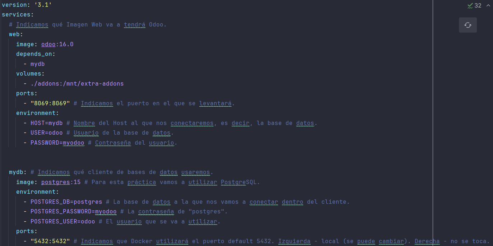

# Odoo + Open Academy

En este repositorio vamos a mostrar cómo instalar y utilizar Open Academy en Odoo, valiéndonos de Docker y PyCharm.

## Estructura docker-compose

A continuación podemos ver la estructura del archivo .yml mediante el que definimos la imagen de Odoo y la base de datos a utilizar.

Imagen del archivo docker-compose.yml

También es importante realizar y configurar la base de datos integrada en el IDE, asegurándonos de que todos los campos estén completos y con la información correcta.

> [!IMPORTANT]
> Para llevar a cabo este paso, antes es necesario levantar nuestro Docker con el comando `docker compose up -d`.

Imagen de la configuración de la base de datos

## Instalación Open Academy

Para instalar el módulo, antes hemos tenido que crear un nuevo directorio en el proyecto llamado `addons`.

A continuación, ejecutamos el siguiente comando:

`docker exec -it odooopenacademy-web-1 odoo scaffold openacademy /mnt/extra-addons`

Y entonces reiniciamos el contenedor de Docker para comprobar que los cambios se hayan efectuado de forma exitosa.

Imagen de la carpeta addons

