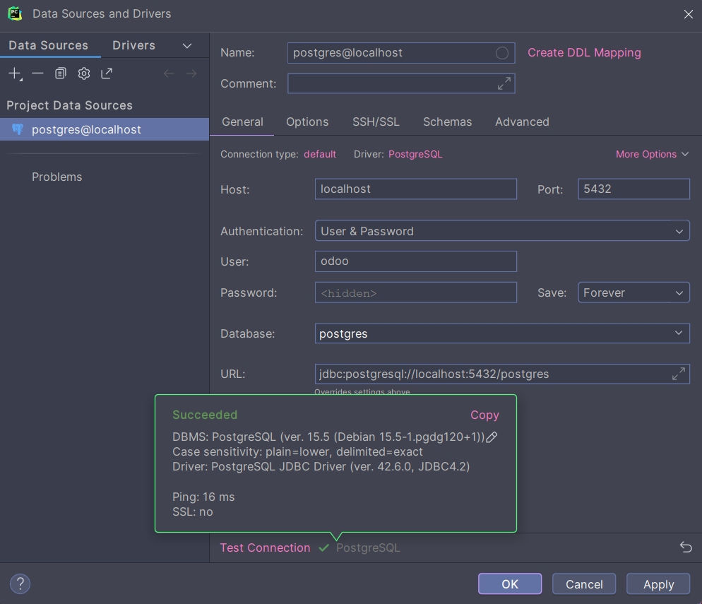

# Odoo + Open Academy

En este repositorio vamos a mostrar cómo instalar y utilizar Open Academy en Odoo, valiéndonos de Docker y PyCharm.

## Estructura docker-compose

A continuación podemos ver la estructura del archivo .yml mediante el que definimos la imagen de Odoo y la base de datos a utilizar.

```py

version: '3.1'
services:
  # Indicamos qué Imagen Web va a tendrá Odoo.
  web:
    image: odoo:16.0
    depends_on:
      - mydb
    volumes:
      - ./addons:/mnt/extra-addons
    ports:
      - "8069:8069" # Indicamos el puerto en el que se levantará.
    environment:
      - HOST=mydb # Nombre del Host al que nos conectaremos, es decir, la base de datos.
      - USER=odoo # Usuario de la base de datos.
      - PASSWORD=myodoo # Contraseña del usuario.


  mydb: # Indicamos qué cliente de bases de datos usaremos.
    image: postgres:15 # Para esta práctica vamos a utilizar PostgreSQL.
    environment:
      - POSTGRES_DB=postgres # La base de datos a la que nos vamos a conectar dentro del cliente.
      - POSTGRES_PASSWORD=myodoo # La contraseña de "postgres".
      - POSTGRES_USER=odoo # El usuario que se va a utilizar.
    ports:
      - "5432:5432" # Indicamos que Docker utilizará el puerto default 5432. Izquierda - local (se puede cambiar). Derecha - no se toca.

```

También es importante realizar y configurar la base de datos integrada en el IDE, asegurándonos de que todos los campos estén completos y con la información correcta.

> [!IMPORTANT]
> Para llevar a cabo este paso, antes es necesario levantar nuestro Docker con el comando `docker compose up -d`.

<details>
<summary>Imagen de la configuración de la base de datos</summary>



</details>
<p>
<p>

## Instalación Open Academy

Para instalar el módulo, antes hemos tenido que crear un nuevo directorio en el proyecto llamado `addons`.

A continuación, ejecutamos el siguiente comando:

`docker exec -it odooopenacademy-web-1 odoo scaffold openacademy /mnt/extra-addons`

Y entonces reiniciamos el contenedor de Docker para comprobar que los cambios se hayan efectuado de forma exitosa.

<details>
<summary>Imagen de la carpeta addons</summary>


</details>
<p>
<p>

## Configuración Open Academy

> [!IMPORTANT]
> Es necesario activar el modo de desarrollador (con assets) para poder visualizar y activar el módulo. Del mismo modo, en la barra de búsqueda de la pestaña "Apps" es necesario eliminar las etiquetas y buscar solamente nuestro módulo.

<details>
<summary>Imagen del modo desarrollador</summary>


</details>
<p>
<p>

Si nos fijamos más a fondo y entramos en la información del módulo, encontraremos varios campos (como sitio web, categoría, resumen, etc.) que podemos modificar desde nuestro IDE en el archivo `manifest.py`, que contiene toda esta información.

Aquí tenemos el código de este caso específico, ya modificado:

```py

# -*- coding: utf-8 -*-
{
    'name': "openacademy",

    'summary': """
        Borja para SXE.""",

    'description': """
        Módulo personalizado por Borja G. Barrera para SXE.
    """,

    'author': "JayBGB",
    'website': "https://github.com/JayBGB",

    # Categories can be used to filter modules in modules listing
    # Check https://github.com/odoo/odoo/blob/16.0/odoo/addons/base/data/ir_module_category_data.xml
    # for the full list
    'category': 'Alpha',
    'version': '0.1',

    # any module necessary for this one to work correctly
    'depends': ['base'],

    # always loaded
    'data': [
        'security/ir.model.access.csv',
        'views/views.xml',
        'views/templates.xml',
        'data/datos.xml',
    ],
    # only loaded in demonstration mode
    'demo': [
        'demo/demo.xml',
    ],
}

```

Con estas modificaciones, la información del módulo en Odoo se vería así:

<details>
<summary>Imagen de la información del módulo</summary>


</details>
<p>
<p>

## Creación y configuración de tablas

Para la creación de tablas en la base de datos es necesario modificar varios archivos. El primero será `models.py`, situado en el directorio `models`. Aquí encontraremos la estructura que conforma una tabla, la cual modificaremos para satisfacer nuestras necesidades.

```py

from odoo import fields, models

class usuarios(models.Model):
    _name = 'usuarios'
    _description = 'tabla de usuarios'

    name = fields.Char(String = 'Name')
    description = fields.Char(String = 'Description')

```

Tras realizar los cambios, reiniciamos el contenedor con `docker compose restart`, hacemos `Upgrade` en el módulo en Odoo y actualizamos la base de datos en el IDE. Así, encontraremos nuestra nueva tabla en `public/tables`:

<details>
<summary>Imagen de la tabla integrada en el IDE</summary>


</details>
<p>
<p>

> [!WARNING]
> SIEMPRE hemos de hacer Upgrade en el módulo (al buscarlo, desplegamos su menú de opciones y ejecutamos la opción), de lo contrario los cambios no se podrán observar.

> [!NOTE]
> Tras crear una tabla aún no podrá ser visualizada en OpenAcademy, incluso tras hacer Upgrade. Para ello, hay que modificar y ajustar otros archivos.

El primer paso para poder visualizar la tabla desde el navegador es crear un nuevo directorio en `addons/openacademy` llamado `data`. En el crearemos un archivo `.xml` con el siguiente código:

```xml

<odoo>
    <data>

        <record model="usuarios" id="openacademy.usuarios">

            <field name="name">Jay</field>
            <field name="description">Senior Full Stack Developer</field>

        </record>

    </data>
</odoo>

```

Cuando este archivo esté correctamente configurado, debemos añadirlo en la sección `data` del archivo `manifest.py` que modificamos anteriormente para que éste tenga en cuenta la nueva información.

```py

    # always loaded
    'data': [
        # 'security/ir.model.access.csv',
        'views/views.xml',
        'views/templates.xml',
        'data/datos.xml',
    ],

```

A continuación modificaremos `views.xml` del directorio `views`. Esto nos permitirá definir la estructura de la tabla que vamos a visualizar, crear un menú desplegable botones, etc.

```xml

<odoo>
  <data>
    <!-- explicit list view definition -->

    <record model="ir.ui.view" id="openacademy.lista_usuarios">
      <field name="name">openacademy list</field>
      <field name="model">usuarios</field>
      <field name="arch" type="xml">
        <tree>
          <field name="name"/>
          <field name="description"/>
        </tree>
      </field>
    </record>


    <!-- actions opening views on models -->

    <record model="ir.actions.act_window" id="openacademy.action_window_usuarios">
      <field name="name">openacademy window</field>
      <field name="res_model">usuarios</field>
      <field name="view_mode">tree,form</field>
    </record>

    <!-- server action to the one above -->
<!--
    <record model="ir.actions.server" id="openacademy.action_server">
      <field name="name">openacademy server</field>
      <field name="model_id" ref="model_openacademy_openacademy"/>
      <field name="state">code</field>
      <field name="code">
        action = {
          "type": "ir.actions.act_window",
          "view_mode": "tree,form",
          "res_model": model._name,
        }
      </field>
    </record>
-->

    <!-- Top menu item -->

    <menuitem name="openacademy" id="openacademy.menu_root"/>

    <!-- menu categories -->

    <menuitem name="User Button" id="openacademy.menu_usuarios" parent="openacademy.menu_root"/>

<!--
    <menuitem name="Menu 2" id="openacademy.menu_2" parent="openacademy.menu_root"/>
-->

    <!-- actions -->

    <menuitem name="User List" id="openacademy.listaUsuarios" parent="openacademy.menu_usuarios"
              action="openacademy.action_window_usuarios"/>
<!--
    <menuitem name="Server to list" id="openacademy" parent="openacademy.menu_2"
              action="openacademy.action_server"/>
-->
  </data>
</odoo>

```

El último paso consiste en modificar `security/ir.model.access.csv` y el `manifest.py` para que Odoo lo pueda cargar.

En el archivo `ir.model.access.csv` cambiaremos el nombre del modelo y el grupo al que pertenece.

```py

id,name,model_id:id,group_id:id,perm_read,perm_write,perm_create,perm_unlink
access_openacademy_usuarios,openacademy.openacademy,model_usuarios,base.group_user,1,1,1,1

```

En el `manifest.py`, "descomentamos" la línea de `security`.

```py

    # always loaded
    'data': [
        'security/ir.model.access.csv',
        'views/views.xml',
        'views/templates.xml',
        'data/datos.xml',
    ],

```

## Visualización en Odoo

Una vez más, reiniciamos el contenedor y hacemos Upgrade del módulo. Recargamos la página en nuestro navegador y accedemos, a través del menú desplegable de arriba a la izquierda, a `openacademy`, donde ahora podremos ver y modificar la tabla como deseemos, creando nuevos usuarios, viendo los existentes, etc.

<details>
<summary>Imagen de la vista de usuarios en web</summary>


</details>
<p>
<p>

<details>
<summary>Imagen de la creación de un usuario en web</summary>


</details>
<p>
<p>

<details>
<summary>Imagen de la vista tras la creación de otro usuario</summary>


</details>
<p>
<p>

<details>
<summary>Imagen de la base de datos con el nuevo usuario en el IDE</summary>


</details>
<p>
<p>

Con todo esto listo, ya tenemos nuestra página con base de datos completamente funcional.

# 
#
#
### Proyecto realizado por Borja García Barrera. ¡Espero haber sido de ayuda!